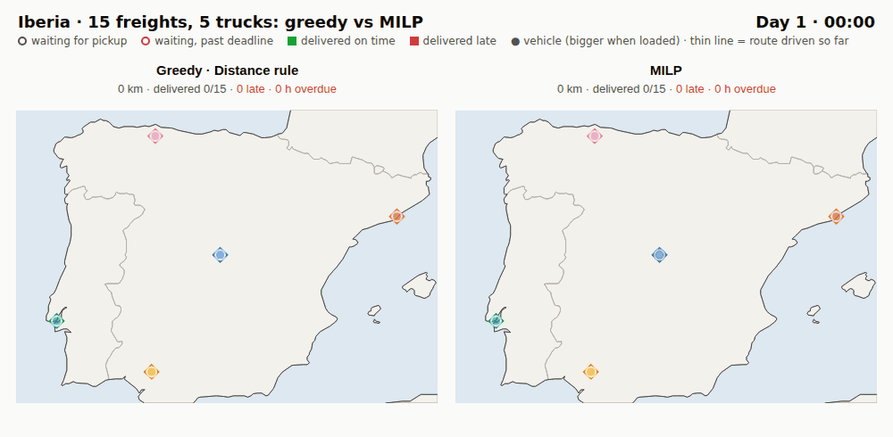
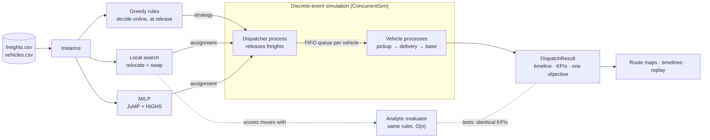
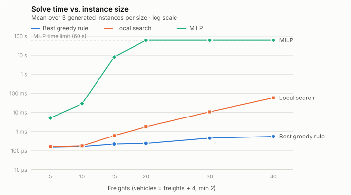
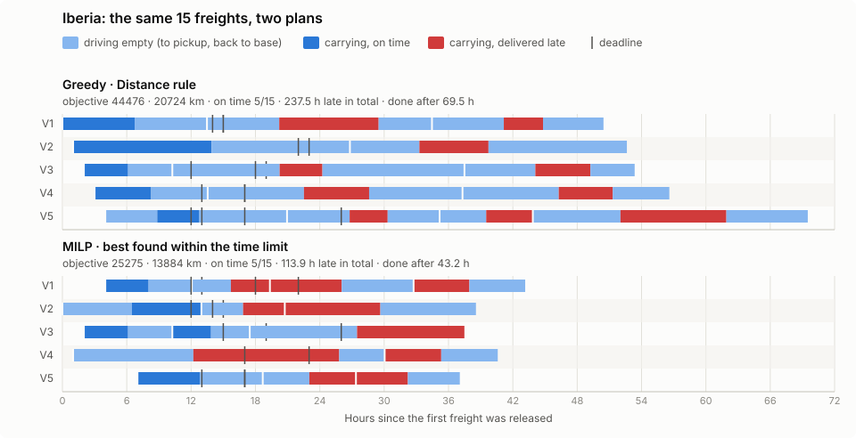
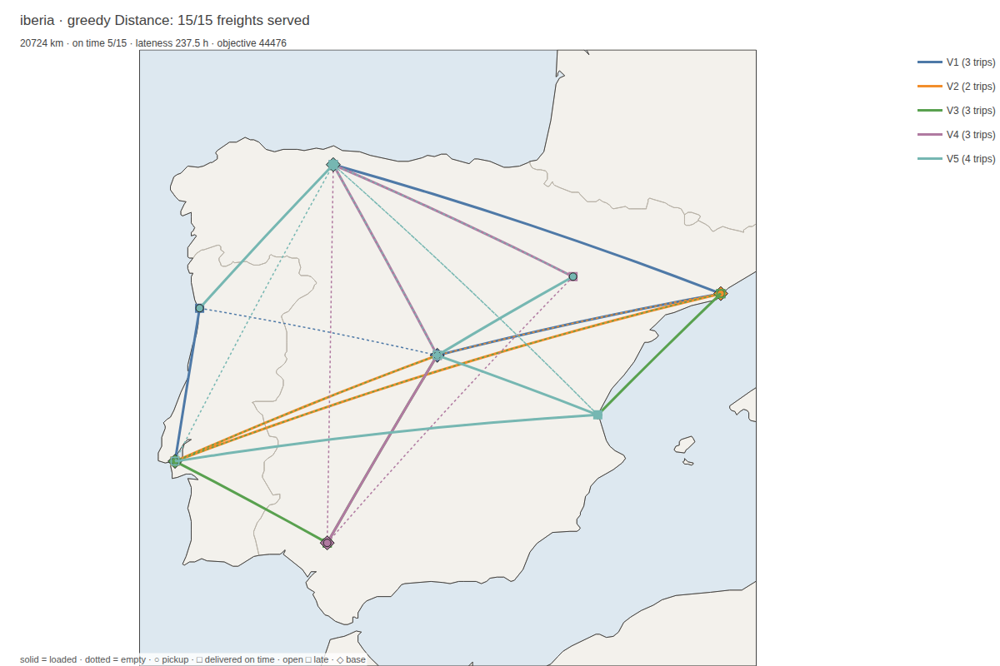
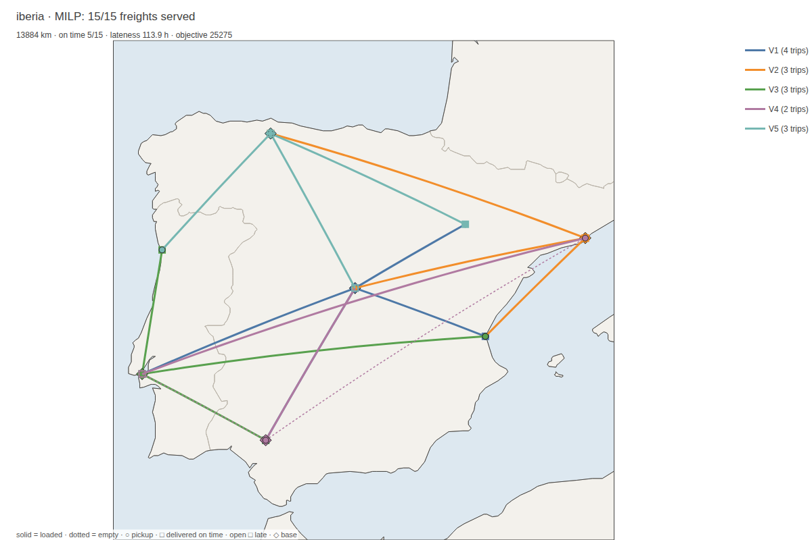

# Freight Dispatch Simulator

[](https://github.com/alexgoldhoorn/freight-dispatch-simulator/actions/workflows/CI.yml)

A Julia showcase of three ways to dispatch freight to a vehicle fleet: **greedy
online rules**, **local search** and an **exact MILP**. All three are evaluated in
**the same discrete-event simulation**, so their numbers can be compared directly.



*The same 15 freights and 5 trucks, dispatched by a greedy rule (left) and by the MILP (right), on a shared clock.
Open circles are freights waiting for pickup (red once their deadline has passed); squares are deliveries, green if on time and red if late.
The MILP drives 33 % fewer km and has half the overdue hours: 43 % cheaper on the shared objective (km + 100 × hours late).
Interactive version with play/pause and a time slider: [`docs/replay/iberia.html`](docs/replay/iberia.html) (download and open in a browser).*

## What it does

- **Discrete-event simulation** ([ConcurrentSim.jl](https://github.com/JuliaDynamics/ConcurrentSim.jl)).
  Freights are released over time. A dispatcher assigns each one when it is
  released. Vehicles queue their work and drive pickup → delivery → base. The
  simulation records the full timeline, lateness against deadlines, and
  utilization.
- **Four greedy rules**: FCFS, nearest vehicle, shortest trip, earliest delivery.
  Each takes microseconds per decision and uses no future information.
- **Local search**: relocate and swap moves starting from the best greedy solution.
- **MILP** ([JuMP](https://jump.dev) + [HiGHS](https://highs.dev)): the optimal
  assignment under *exactly* the simulation's rules. The tests check that the
  solver's objective equals the objective the simulation measures for its solution.
- **One evaluator**: every method's assignment is replayed through the simulation
  and scored with the same objective and KPIs.
- **Reproducible benchmark**, instance generator, interactive route maps and a CLI.

The model, the rules and the MILP formulation are in
[SOLUTION_APPROACHES.md](SOLUTION_APPROACHES.md).

## How it fits together



Every method ends in the same simulation, so every number in this README comes
from the same evaluator. The MILP models the simulation's rules exactly, and the
tests check that its objective matches the replay.

## Quick start

```bash
git clone https://github.com/alexgoldhoorn/freight-dispatch-simulator.git
cd freight-dispatch-simulator
julia --project=. -e 'using Pkg; Pkg.instantiate()'
```

```julia
using FreightDispatchSimulator

inst = load_instance("data/iberia")              # freights.csv + vehicles.csv

greedy = simulate(inst, DistanceStrategy())      # online greedy rule in the simulation
ls     = local_search_optimize(inst; initial = greedy)
milp   = optimize_dispatch(inst; time_limit = 60)

greedy.kpis          # objective, km, on-time count, lateness, makespan, utilization, ...
milp.info            # solver status, proven_optimal, gap, model objective

table, results = compare_methods(inst)          # every method, one table
generate_route_map(milp, inst, "route_map.html")
```

`simulate` returns a `DispatchResult` with:

- `freight_results`: per freight, the assigned vehicle and the times of release,
  trip start, pickup, delivery, return to base and lateness, plus km and coordinates;
- `vehicle_aggregates`: per vehicle, km, busy time, number of trips and utilization;
- `kpis`: summary metrics, including the objective.

The input DataFrames are never modified.

### Command line

```bash
julia --project=. scripts/main.jl data/iberia MILP results.csv -m route_map.html
julia --project=. scripts/main.jl data/urban compare results.csv
julia --project=. scripts/main.jl --help
```

Methods: `FCFS`, `Cost`, `Distance`, `OverallCost`, `LocalSearch`, `MILP`, `compare`.

## Results

Summary of [docs/BENCHMARK.md](docs/BENCHMARK.md), which `julia --project=. scripts/benchmark.jl` regenerates:

| Dataset | Freights × vehicles | Best greedy rule (gap) | Local search gap | MILP gap | MILP time |
|---|---|---|---:|---:|---:|
| `urban` | 15 × 5 | Distance (0.0 %) | 0.0 % | 0.0 % ✓ | 0.02 s |
| `eu_urban` | 12 × 4 | OverallCost (0.0 %) | 0.0 % | 0.0 % ✓ | 0.11 s |
| `benelux` | 12 × 4 | OverallCost (0.0 %) | 0.0 % | 0.0 % ✓ | 1.11 s |
| `longhaul` | 8 × 3 | FCFS (35.5 %) | 0.0 % | 0.0 % ✓ | 0.19 s |
| `eu_longhaul` | 10 × 4 | OverallCost (21.6 %) | 0.0 % | 0.0 % ✓ | 4.46 s |
| `iberia` | 15 × 5 | OverallCost (53.2 %) | 0.1 % | 0.0 % (time limit) | 60 s |
| `mixed` | 20 × 6 | OverallCost (17.1 %) | 3.1 % | 0.0 % ✓ | 42 s |
| `test1` | 20 × 15 | OverallCost (0.4 %) | 0.0 % | 0.0 % ✓ | 2.71 s |

Gap = how far above the best objective found for that dataset. ✓ = the MILP proved optimality.
All greedy rules and local search run in under 5 ms on these datasets.



Why the MILP wins on `iberia`, trip by trip (hover a trip for details):



The greedy rule gives each freight to the idle truck with the shortest trip,
without looking ahead. Trucks then make long empty runs (light blue) and are
still busy when later freights arrive. The MILP plans all 15 freights at once:
less empty driving, and all trucks are back after 43 h instead of 70 h.

<details>
<summary>Static route maps (greedy vs MILP)</summary>

| Greedy (Distance rule) | MILP |
|---|---|
|  |  |

Interactive versions for three datasets are in [`docs/maps/`](docs/maps/).
</details>

Main points:

- No single greedy rule wins everywhere. *OverallCost* considers queues and is best
  on most datasets, yet it can still be more than 50 % above the best solution (`iberia`).
- Local search reaches or comes within 3 % of the best solution on every dataset,
  in milliseconds.
- The MILP proves optimality up to about 15–20 freights. Beyond that it hits the
  60 s limit, and on generated instances with 30–40 freights local search finds
  better solutions than the time-limited MILP (see [docs/BENCHMARK.md](docs/BENCHMARK.md)).

## Data format

`freights.csv`

```csv
id,weight_kg,pickup_lat,pickup_lon,delivery_lat,delivery_lon,pickup_time,delivery_time
F1,800.0,40.4168,-3.7038,41.3851,2.1734,0.0,54000.0
```

`pickup_time` is the release time and `delivery_time` the deadline. Both are in
seconds (any origin) or `DateTime`s.

`vehicles.csv`

```csv
id,start_lat,start_lon,capacity_kg,speed_km_per_hour
V1,40.4168,-3.7038,3500.0,75.0
```

Optional `base_lat`, `base_lon` columns set a base different from the start location.

`generate_instance(n_freights, n_vehicles; seed)` creates random instances (Catalonia by default).

### Included datasets

| Dataset | Freights × vehicles | Region |
|---|---|---|
| `urban` | 15 × 5 | New York City |
| `longhaul` | 8 × 3 | United States |
| `mixed` | 20 × 6 | United States, urban + long-haul |
| `eu_urban` | 12 × 4 | Netherlands |
| `eu_longhaul` | 10 × 4 | Europe |
| `iberia` | 15 × 5 | Spain and Portugal |
| `benelux` | 12 × 4 | Belgium, Netherlands, Luxembourg |
| `test1` | 20 × 15 | Iberia, large fleet |
| `test0`, `test_failure` | 2–3 × 2 | Tests; `test_failure` has a freight no vehicle can carry |

## Project layout

```
src/
  FreightDispatchSimulator.jl   module and exports
  types.jl                      Freight, Vehicle, Instance, Trip, results, loading
  distances.jl                  haversine, travel time
  schedule.jl                   execution rules, analytic evaluator, KPIs
  strategies.jl                 greedy dispatch rules
  simulation.jl                 discrete-event simulation (ConcurrentSim)
  LocalSearch.jl                relocate/swap local search
  MILPOptimizer.jl              MILP (JuMP + HiGHS)
  experiments.jl                compare_methods, generate_instance
  MapVisualization.jl           interactive HTML route maps (plotly.js)
  Timeline.jl                   vehicle timeline (Gantt) SVG
  Replay.jl                     animated side-by-side replay (HTML)
scripts/                        CLI, benchmark, visuals, GIF capture
docs/                           benchmark results, maps, replay, charts
examples.ipynb                  walkthrough notebook
```

## Development

```bash
julia --project=. -e 'using Pkg; Pkg.test()'       # tests (CI runs Julia 1.10 and latest)
julia --project=. scripts/benchmark.jl            # regenerate docs/BENCHMARK.md
julia --project=. scripts/render_visuals.jl       # regenerate maps, timeline and replay page in docs/
node scripts/capture/capture_replay.js docs/replay/iberia.html frames/ && \
  python3 scripts/capture/make_gif.py frames/ docs/assets/replay_iberia.gif   # README GIF
```

Formatting: `.JuliaFormatter.toml` (Blue style).

## Background

This project condenses problems I worked on professionally: discrete-event
simulation for testing courier–order matching algorithms (Glovo), and freight
planning for road transport (Meight). It deliberately keeps a compact model (full
truckloads, return to base, no road network), so that the simulation, the
heuristics and the exact model stay small enough to read in one sitting.

## Possible extensions

- Rolling-horizon re-optimisation: re-run local search or MILP on the freights not yet started.
- Consolidation (several freights per trip) and within-vehicle reordering, i.e. a real VRP with time windows.
- Stochastic travel times, to measure how robust each policy is in simulation.
- Learning a dispatch policy from simulated data and comparing it with the MILP optimum.

## License

MIT
